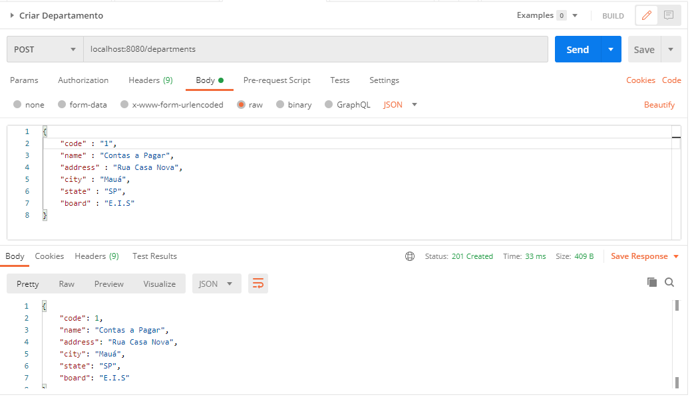
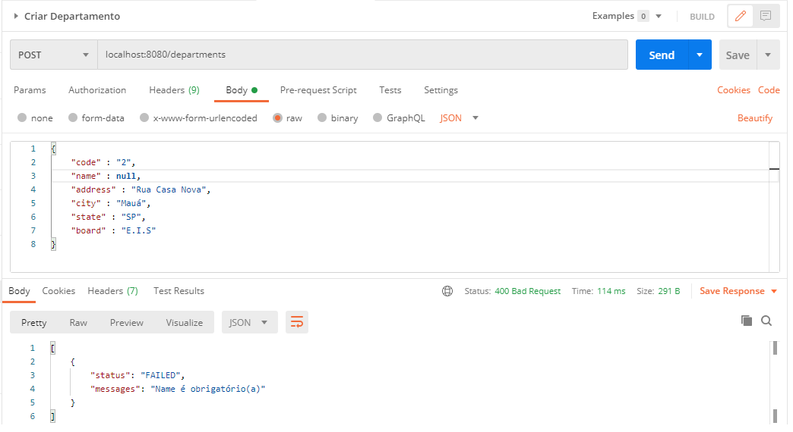
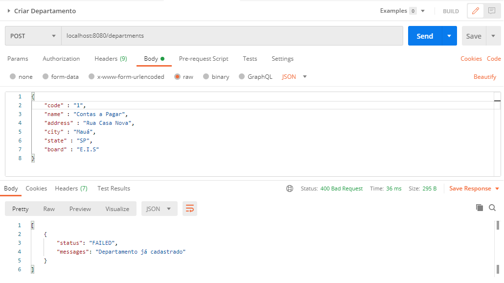
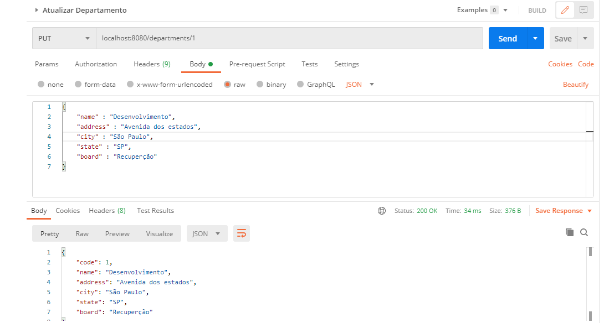
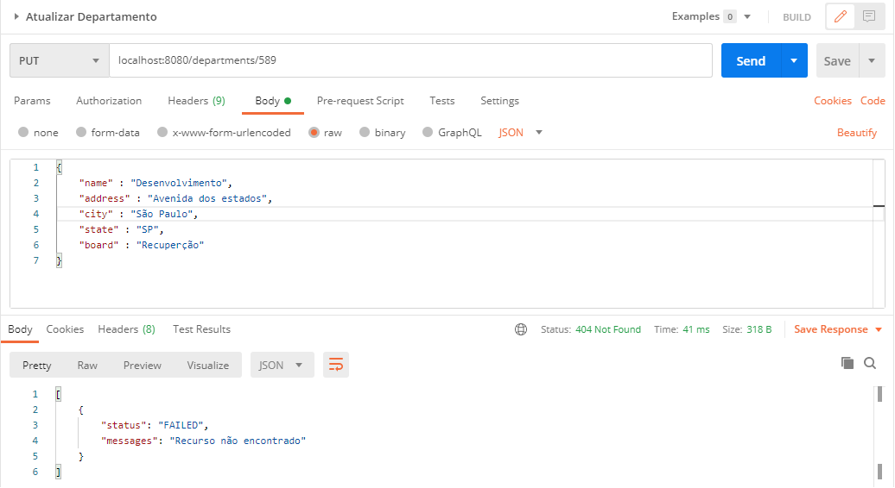
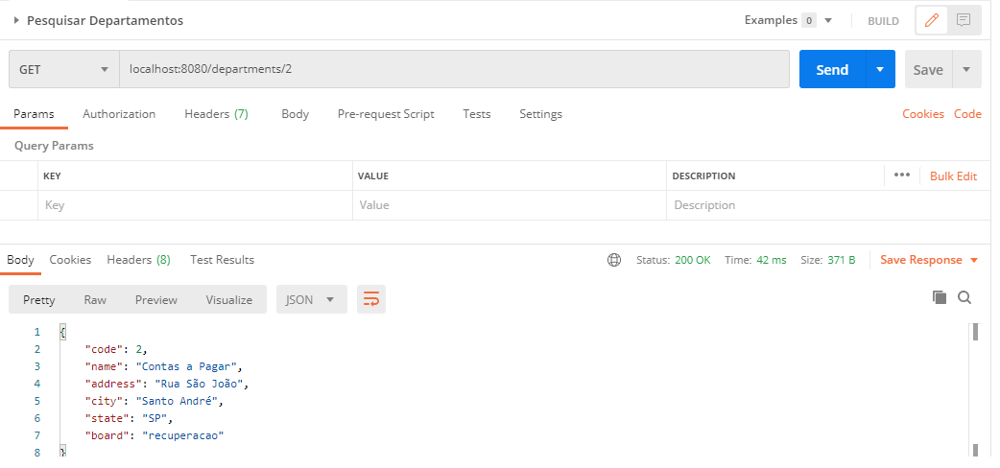
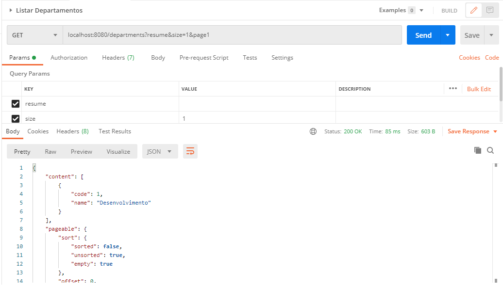
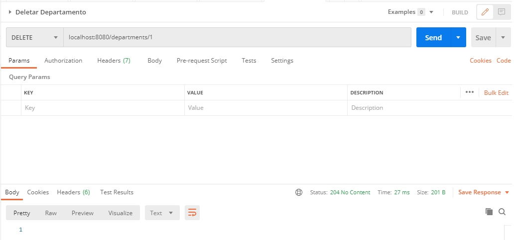

# ProjetoItauDepartamento

Projeto desenvolvido utilizando o ecossistema spring(Web, JPA, Validation, Testing) versão 2.3.1, Java 11, Maven no build e gerenciamento de depêndencias, arquitetura REST no desenvolvimento dos serviços, Lombok para redução de código boilerplate, testes unitários utilizando Mock e JUnit, banco de dados MySQL e
Flyway no controle de versionamento dos script de banco de dados.
* Serviços disponibilizados:

## Cadastro de departamentos

## Cadastro de departamentos validação de campo obrigatório

## Cadastro de departamentos validação departamento já cadastrado

## Alteração de departamentos

## Alteração de departamentos validação recurso não encontrado

## Pesquisa de departamento pelo código

## Listagem de departamento resumido e paginado

## Exclusão de departamento

